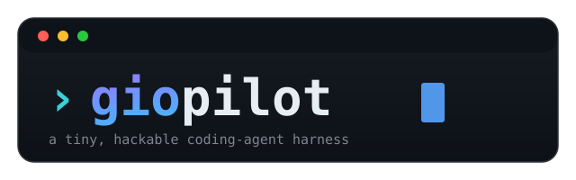

<div align="center">



<h3>A tiny, hackable coding-agent harness on the GitHub Copilot SDK.</h3>

<p>
  <a href="#-quick-start">Quick start</a> ·
  <a href="./docs/usage.md">Usage</a> ·
  <a href="./docs/architecture.md">Architecture</a> ·
  <a href="./docs/adr">Decisions</a> ·
  <a href="./docs/development.md">Development</a>
</p>

<p>
  
  
  
  
  
  
</p>

</div>

---

**giopilot** keeps a tiny core and makes GitHub Copilot *feel* like [Pi](https://pi.dev/): a
minimal system prompt, lazily-injected **skills**, an in-process TypeScript **extension**
mechanism, durable **memory**, and a clean terminal UI. The
[GitHub Copilot SDK](https://github.com/github/copilot-sdk) owns the agent loop (planning,
tool calls, file edits, built-in Read/Write/Edit/Bash); giopilot wraps it and controls the
prompt, the tools, the skills, and the extension surface around it.

```text
›giopilot   model: auto · idle · ⎇ main · ◆ 7.4 / 200 used
```

## ✨ Features

| | |
|---|---|
| 🪶 **Tiny core** | A `<1000`-token system prompt; the SDK's built-in tools do the heavy lifting. |
| 🧩 **Lazy skills** | One line per skill in context; full `SKILL.md` loaded on demand via `load_skill` / `/skill:name`. |
| 🔌 **Extensions** | In-process TS modules: register tools, commands, prompt fragments, and permission gates. |
| 🧠 **Memory** | `remember` / `recall` durable facts as markdown, injected as a one-line index. |
| 🛡️ **Permissions** | Per-kind allow/deny policy plus extension gates, instead of blanket approval. |
| 🖥️ **Ink TUI** | Streaming transcript, model picker, command autocomplete, and a live status line. |
| 📊 **Status line** | Model · status · git branch · Copilot credits (the same figure VS Code shows). |
| ✅ **Quality-gated** | TDD, ~100% coverage, ESLint, cyclomatic complexity ≤ 5 — enforced pre-commit and in CI. |

## 🚀 Quick start

> **Prerequisite:** a GitHub Copilot subscription and authentication. The SDK manages the
> bundled Copilot CLI; the first run may prompt you to sign in.

```bash
npm install
npm run build
npm link            # puts `giopilot` on your PATH

giopilot                      # interactive TUI
giopilot "list the files"     # one-shot: run a task, then exit
giopilot --model gpt-5-mini   # pick a model
giopilot update               # check for a newer version
```

In the TUI, type a prompt — or a slash command (Tab to autocomplete):

| Command | Does |
|---|---|
| `/skills` · `/skill:<name>` | List skills · load one and act on it |
| `/model` | Pick the model (from `listModels()`) |
| `/<command>` | Run an extension command |
| `/help` · `/exit` | Help · quit |

## 📚 Documentation

| Guide | What's inside |
|---|---|
| [**Usage**](./docs/usage.md) | TUI, commands, status line, one-shot, self-update |
| [**Configuration**](./docs/configuration.md) | `.giopilot/` layout, `settings.json`, permission policy |
| [**Skills**](./docs/skills.md) | Authoring `SKILL.md`, lazy loading |
| [**Extensions**](./docs/extensions.md) | The `HarnessAPI`, writing & loading extensions |
| [**Memory**](./docs/memory.md) | How `remember`/`recall` and the index work |
| [**Architecture**](./docs/architecture.md) | Modules, data flow, the wrap-the-loop design |
| [**Decisions (ADRs)**](./docs/adr) | Why the key choices were made |
| [**Notes**](./docs/notes.md) | Caveats, gotchas, and known limitations |
| [**Development**](./docs/development.md) | TDD workflow, quality gates, CI & releases |

## 🏗️ How it works (in one breath)

`config` resolves settings → `harness` discovers skills/memory/extensions, assembles the
minimal prompt, and opens a Copilot session with a curated tool set and a composed permission
handler → the framework-free `SessionController` drives turns and holds UI state → a thin
**Ink** view renders it. See [the architecture guide](./docs/architecture.md) for the diagram.

## 📄 License

[MIT](./LICENSE)
