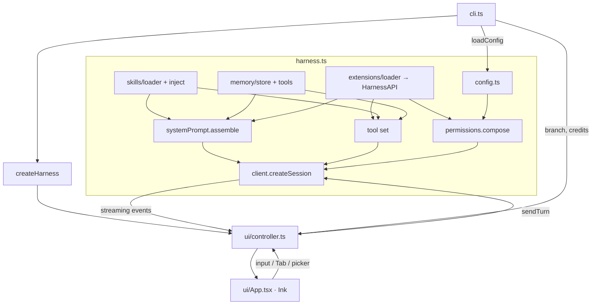

# Architecture

[← Back to README](../README.md)

## The one idea

The GitHub Copilot SDK exposes a **managed** agent session — it owns the
plan→tool→edit loop and ships built-in Read/Write/Edit/Bash tools. giopilot does **not**
reimplement that loop. It **wraps** it and makes Copilot *feel* like Pi by controlling four
things around the session:

1. the **system prompt** (minimal, `mode: "replace"`),
2. the **tool set** (`load_skill`, `remember`, `recall`, plus extension tools),
3. the **permission handler** (composed policy + gates),
4. the **streaming events** (rendered into a transcript).

See [ADR&nbsp;0001](./adr/0001-wrap-copilot-managed-loop.md) for why.

## Data flow

## Responsibilities

| Layer | Modules | Responsibility |
|---|---|---|
| **Entry** | `cli.ts` | Parse flags, choose one-shot vs TUI, resolve token, wire the status line. |
| **Config** | `config.ts` | Merge global + project settings; locate skill/extension/memory dirs. |
| **Assembly** | `systemPrompt.ts`, `manifest.ts`, `frontmatter.ts` | Build the minimal prompt and manifests. |
| **Capabilities** | `skills/*`, `memory/*`, `extensions/*` | Lazy skills, durable memory, in-process extensions. |
| **Session** | `harness.ts`, `permissions.ts` | Open and re-open the Copilot session; compose permissions; wire events. |
| **Interaction** | `repl.ts`, `complete.ts`, `models.ts`, `shell.ts` | Slash-command dispatch, autocomplete, model selection, `!` shell pass-through. |
| **UI** | `ui/controller.ts`, `ui/App.tsx`, `statusline.ts` | Framework-free state + a thin Ink view. |
| **Ops** | `version.ts`, `git.ts`, `credits.ts` | Self-update, branch, Copilot credits. |

## Key seams

giopilot depends on the SDK through **narrow interfaces** so tests use hand-written doubles
instead of mocking the SDK:

- `ClientLike` / `SessionLike` — the slice of `CopilotClient` / session the harness needs.
- `FetchLike` — injected into `version.ts` and `credits.ts` for offline tests.
- `ReplIO` — output sink for command dispatch (stdout in prod, captured in tests).

All interactive logic lives in `SessionController` (plain TypeScript, no React), which is why
the Ink view is a thin subscriber and the logic is fully unit-tested. See
[ADR&nbsp;0002](./adr/0002-typescript-ink-tui.md).
